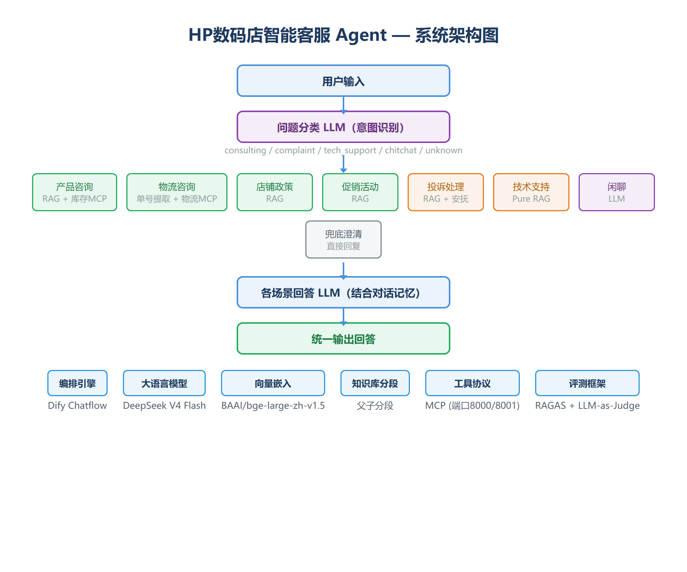

# HP数码店智能客服 Agent

基于大模型的多场景电商客服智能体，使用 Dify 作为编排引擎，结合 RAG 知识库检索与 MCP 工具调用，覆盖产品咨询、物流查询、店铺政策、促销活动、投诉处理、技术支持 6 大业务场景。

## 项目背景

电商店铺私信咨询量大，人工客服响应不及时导致漏单；夜间/高峰期覆盖不足，人力成本高；用户问题高度重复（产品参数、物流、退换货政策），具备自动化应答空间。本项目目标是搭建一款能理解用户意图、自动调用业务数据、结合知识库进行专业应答的智能客服，覆盖售前咨询到售后支持全链路。

## 核心功能

| 场景 | 技术方案 | 说明 |
|------|---------|------|
| 产品咨询 | RAG + 库存MCP | 知识库获取产品参数，MCP实时查询库存 |
| 物流咨询 | 订单号/运单号提取 + 物流MCP | 自动提取单号，实时查询物流状态 |
| 店铺政策 | RAG | 退换货、保修、发票、价保等政策问答 |
| 促销活动 | RAG | 618/会员权益/优惠券等活动咨询 |
| 投诉处理 | RAG + 人性化回复 | 基于知识库安抚并给出解决方案 |
| 技术支持 | Pure RAG | 维修手册检索，故障现象匹配解决方案 |
| 闲聊 | LLM | 人格化设定，适时引导回业务 |
| 兜底澄清 | 直接回复 | 语义不完整/无关请求的澄清与引导 |

## 系统架构



- **编排引擎**：Dify Chatflow（意图分类 → 条件分支 → 知识检索 → 工具调用 → 回答生成）
- **知识库**：父子分段 + BAAI/bge-large-zh-v1.5 向量嵌入
- **MCP工具**：库存查询（端口8000）、物流查询（端口8001）
- **模型**：DeepSeek V4 Flash

## 快速开始

### 1. 启动 MCP 服务

```bash
# 库存查询服务（端口8000）
python mcp-servers/stock_mcp_server.py

# 物流查询服务（端口8001）
python mcp-servers/logistics_mcp_server.py
```

### 2. 导入 Dify 工作流

1. 在 Dify 工作室创建 Chatflow 应用
2. 将 `dify-workflow/` 目录下的工作流文件导入（需自行从 Dify 导出后放入）
3. 在「工具 → MCP」中添加两个 MCP 服务：
   - 库存：`http://host.docker.internal:8000/mcp`
   - 物流：`http://host.docker.internal:8001/mcp`
4. 在「知识库」中导入 `knowledge-base/product_knowledge.txt`，使用父子分段模式

### 3. 运行评测

```bash
cd evaluation
# 配置 Dify API Key 和 DeepSeek API Key 后运行
python run_eval.py
```

## 评测结果

基于 104 条标注测试集（每条跑 3 次取最优），第五轮评测结果：

| 指标 | 数值 |
|------|------|
| 对话完成率 | **100%** |
| 路由准确率 | **94.2%** |
| Faithfulness（回答忠实度） | **0.988** |
| Answer Relevancy（回答相关性） | **0.988** |
| Context Recall（上下文召回率） | **0.904** |
| 库存MCP调用成功率 | **100%** |
| 物流MCP调用成功率 | **100%** |
| 平均响应时间 | 8.6s |

### 迭代历程

| 轮次 | 完成率 | 路由准确率 | Faithfulness | 关键改进 |
|------|--------|-----------|-------------|---------|
| 第一轮 | 94.2% | 76.9% | 0.840 | 基线 |
| 第二轮 | 87.5% | 80.8% | 0.880 | 修复物流MCP返回格式、优化分类器提示词 |
| 第四轮 | 94.2% | 89.4% | 0.976 | 每条3次取最优，消除偶发波动 |
| 第五轮 | **100%** | **94.2%** | **0.988** | 修复兜底节点连接、调整分类器关键词 |

详细评测数据见 [evaluation/](evaluation/) 目录。

## 项目结构

```
hp-digital-customer-service-agent/
├── README.md                    # 本文件
├── docs/                        # 设计文档
│   ├── architecture.md          # 系统架构与技术选型
│   ├── workflow-design.md       # 对话流程与分支设计
│   └── evaluation-system.md     # 评测体系说明
├── mcp-servers/                 # MCP工具服务
│   ├── stock_mcp_server.py      # 库存查询MCP
│   ├── stock_data.json          # 库存demo数据
│   ├── logistics_mcp_server.py  # 物流查询MCP
│   └── logistics_data.json      # 物流demo数据
├── knowledge-base/              # 知识库
│   └── product_knowledge.txt    # 产品咨询知识库
├── evaluation/                  # 评测体系
│   ├── eval_testset.json        # 104条标注测试集
│   ├── run_eval.py              # 自动化评测脚本
│   ├── eval_results_r5.json     # 第五轮评测结果
│   └── eval_report_r5.xlsx      # 评测报告Excel
├── dify-workflow/               # Dify工作流导出（需自行放入）
├── assets/                      # 图片资源
│   └── architecture.png         # 系统架构图
├── LICENSE
└── .gitignore
```

## 技术栈

- **编排引擎**：Dify (Chatflow)
- **大语言模型**：DeepSeek V4 Flash
- **向量嵌入**：BAAI/bge-large-zh-v1.5
- **工具协议**：MCP (Model Context Protocol)
- **知识库分段**：父子分段 (Parent-Child Chunking)
- **评测框架**：RAGAS + LLM-as-Judge + 自定义指标

## License

MIT License
